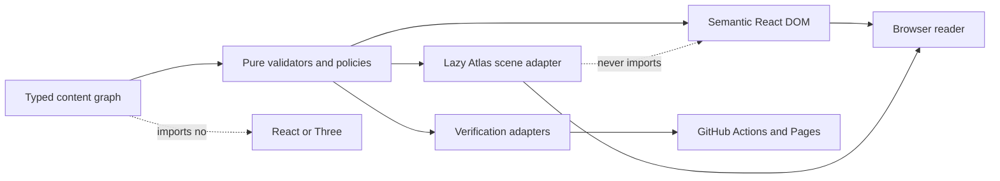
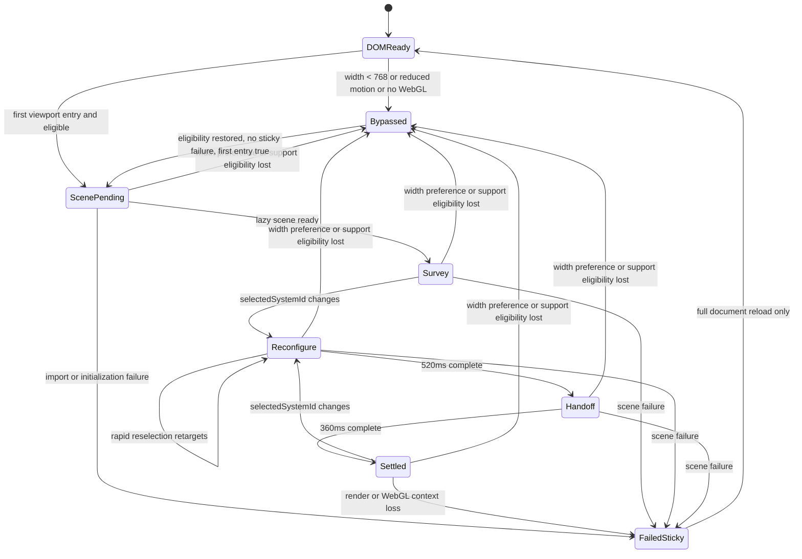
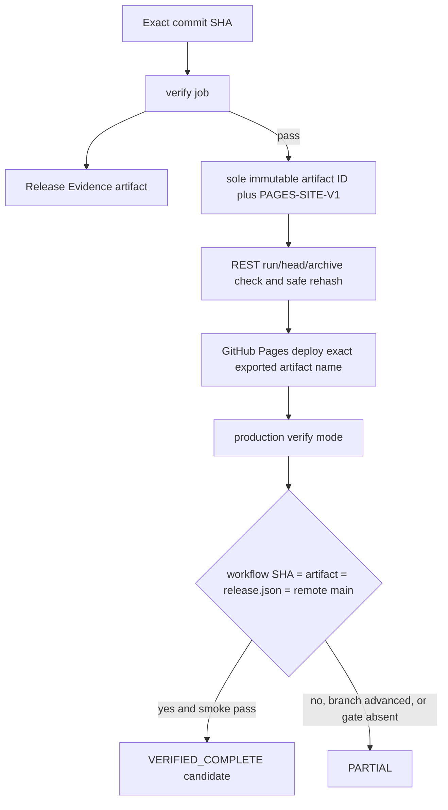

# Architecture Spine — Le Huy Systems Atlas

## Design Paradigm

Use a **functional core with progressive-enhancement adapters**. `src/content` and `src/atlas/core` own immutable, serializable facts and pure validation or state-policy functions. React DOM is the authoritative interaction shell. WebGL, browser capability probes, PDF extraction, filesystem verification, and deployment are adapters around that core.



## Invariants & Rules

### AD-1 — Functional core and adapter boundary [ADOPTED]

- **Binds:** CAP-1 through CAP-7; all source modules.
- **Prevents:** browser, renderer, or release I/O from becoming the only owner of product meaning.
- **Rule:** Content, topology, Claim, eligibility, and validation decisions are pure modules with no React, Three, DOM, filesystem, or network import. React, scene, scripts, tests, and Vite consume the core through explicit adapters.

### AD-2 — One authoritative content graph [ADOPTED]

- **Binds:** CAP-1, CAP-2, CAP-4, CAP-5, CAP-6; System catalog and Claim contract.
- **Prevents:** selector, scene, narrative, metadata, CV, and validator drift.
- **Rule:** `src/content/portfolio.ts` exports the only System, topology, Claim manifest, Claim-instance, narrative, capability-link, contact, and publication-identity graph. No component owns a second project array or hard-coded System relationship.

### AD-3 — DOM owns selection; adapter owns scene status [ADOPTED]

- **Binds:** CAP-2, CAP-3; selector and scene bridge.
- **Prevents:** two selected Systems, scene-controlled navigation, and stale fallback state.
- **Rule:** React product state owns only `selectedSystemId`. The Atlas adapter separately owns ephemeral `sceneStatus: untried | loading | ready | failed-sticky`; it is never serialized or used as product content. `canvasEligible` is pure over width `>=768`, Reduced Motion false, a cached boolean from one successful safe WebGL probe, first Atlas viewport entry, and `sceneStatus !== failed-sticky`. The browser probe is one-shot, detached, and exception-safe: it creates no React Canvas, requests one context, requires the `WEBGL_lose_context` extension, invokes `loseContext()`, removes its probe canvas, and caches true only after successful release. Missing extension, release exception, unsupported context, or cleanup failure caches false and bypasses Canvas; tests bind every branch so no probe context can coexist with the real Canvas. Scene code receives selected immutable topology and never writes selection, content, Claim, focus, or navigation state.

### AD-4 — One bounded Canvas lifecycle [ADOPTED]

- **Binds:** CAP-3; Atlas rendering and responsive behavior.
- **Prevents:** two WebGL contexts, capable-device mobile exceptions, retry loops, and invisible GPU work.
- **Rule:** Only `src/atlas/scene/AtlasScene.tsx` may import `Canvas`. The lazy scene mounts after first viewport entry only while the non-visibility eligibility axes pass; it unmounts when width, preference, support, or failure invalidates eligibility. The adapter subscribes to `webglcontextlost`, calls `preventDefault`, transitions once to `failed-sticky`, unmounts the Canvas, cleans the listener, and preserves DOM selection/focus; import, initialization, render, and context-loss failures share the same reload-only sticky policy. `failed-sticky` resets only on full document reload, so resize, preference changes, re-entry, and reselection never retry a failed import or Canvas. A healthy scene may remount after eligibility returns. Once entered and still eligible, offscreen state keeps selection under demand rendering: reselection updates target refs and the settled target without invalidating or running choreography; re-entry performs at most one state-sync frame snapped to the selected settled state.

### AD-5 — Finite renderer-local choreography [ADOPTED]

- **Binds:** CAP-2, CAP-3; scene and DOM motion.
- **Prevents:** ambient loops, React render churn, stale queued transitions, and motion-only meaning.
- **Rule:** An onscreen selection runs `reconfigure` for `520ms`, then traces the Active Handoff for `360ms`, then reaches `settled`. Every Active Handoff names a required `focusNodeId` equal to its route destination; the destination takes Rust focus during `handoff`. `useFrame` mutates refs and calls `invalidate` only until settled; it never sets React state. Rapid onscreen selection retargets current values. Offscreen selection never starts or queues the 880ms sequence, emits zero continuous invalidations, and re-enters with at most one snap-to-settled sync frame. Reduced Motion bypasses Canvas and spatial DOM motion; no animation repeats without a new input.

### AD-6 — Manifest-owned Claims and reusable evidence keys [ADOPTED]

- **Binds:** CAP-4, CAP-5; all public Claim surfaces.
- **Prevents:** duplicated qualifications, evidence-key false positives, and copy that outruns evidence.
- **Rule:** Each manifest `evidenceKey` is unique and owns exact Claim text, System ID, classification, `publicSafe`, and limitation. Each rendered use has a unique `claimInstanceId` and references one reusable key; surfaces cannot override the manifest fields. `npm run validate:content` fails before build on any mismatch.

### AD-7 — Value-aware privacy validation [ADOPTED]

- **Binds:** CAP-4, CAP-6, CAP-7; source, build, PDF, metadata, and screenshots.
- **Prevents:** category-label false positives and private-value leakage.
- **Rule:** Public category labels are allowlisted. Source `public/**` is closed to `favicon.svg`, `og-image.png`, `robots.txt`, `sitemap.xml`, and `le-huy-software-engineer-cv.pdf`; Vite alone emits `release.json`. Every other public path—including legacy `public/credentials/**`—fails prebuild and must be removed. Validators reject unknown public identities or URLs, secret-shaped values, prohibited booking values and identifiers, unsafe paths, source maps, unexpected binaries, and private output. A separate off-repo confidentiality review reads private evidence and writes only scope plus pass/fail to Release Evidence.

### AD-8 — One token and font layer [ADOPTED]

- **Binds:** CAP-1 through CAP-6; all visual surfaces.
- **Prevents:** legacy dark-dashboard styles, remote-font dependency, and generic card-system drift.
- **Rule:** `src/index.css` implements the root `DESIGN.md` tokens, reset, and global composition; `src/styles/tokens.ts` exposes the typed scene-color projection; section styles use stable class blocks. Geologica Variable and Fragment Mono are packaged locally and imported once. No Google/gstatic font, CSS-in-JS theme, gradient, glass, or generic promotional-card abstraction remains.

### AD-9 — Semantic DOM and contained scene failure [ADOPTED]

- **Binds:** CAP-1, CAP-2, CAP-3, CAP-6; accessibility and navigation.
- **Prevents:** Canvas-only information, inaccessible selection, and page-wide scene crashes.
- **Rule:** Native landmarks, headings, links, buttons, lists, `aria-pressed`, visible focus, and a polite selection/status region expose the whole journey. Mobile navigation is a focus-managed disclosure. Canvas is `aria-hidden`, unfocusable, and pointer-inert. `SceneBoundary` converts import, initialization, context, or render failure into one sticky bypass without retrying.

### AD-10 — Numeric performance and asset budgets [ADOPTED]

- **Binds:** CAP-3, CAP-7; build and release.
- **Prevents:** Three leaking into the entry graph and decorative asset growth.
- **Rule:** Vite sets `build.manifest: true`, `build.sourcemap: false`, and a plugin emits internal `chunk-modules.v1.json` to Release Evidence; absence or malformed `dist/.vite/manifest.json` or module inventory fails. `npm run verify:budget` walks the manifest deterministically, gzips each emitted text file once at level 9, and enforces: eager JS `<=170 KiB`; lazy Atlas JS closure `<=425 KiB`; CSS `<=25 KiB`; first-view Latin font transfer `<=220 KiB`; initial transfer excluding lazy Atlas and CV `<=450 KiB`; each non-font static asset `<=256 KiB`; CV `<=512 KiB`. Eager is every `isEntry` chunk plus recursive static `imports`. Atlas is the recursive static and nested-dynamic closure rooted at the entry's declared Atlas `dynamicImport`, minus eager files; shared files belong to eager only. Any other dynamic root, cycle, missing file, or unclassified JS fails. Fixture manifests cover entry-only, lazy-only, shared, nested-dynamic, cycle, and missing cases. CSS URL traversal identifies actual first-view Latin font files. After all build checks, `scripts/stage-pages.mjs` copies validated public regular files into ignored `artifacts/pages-site/`; it intentionally excludes only internal `dist/.vite/**`, rejects every other dotfile, link, source map, internal record, or unexpected output, and proves all public files were copied byte-for-byte. The ignored `asset-inventory.v1.json` conforms to the Verification Contract's closed, SHA/tree/PAGES-SITE-V1-bound file-record and totals schema. No GLB, texture, raster hero, post-processing, or remote font ships.

### AD-11 — One evidence-producing verifier [ADOPTED]

- **Binds:** CAP-4 through CAP-7; local and hosted acceptance.
- **Prevents:** CI/local command drift and lost Failed Gate evidence.
- **Rule:** `npm run verify` invokes `scripts/verify.mjs`, which records every child result with nonnegative integer `durationMs` before deciding its exit code and always writes schema-v1 `artifacts/release/release-evidence.v1.json` and the Verification Contract's closed `asset-inventory.v1.json`. It composes private/source/history scans, content/topology, typecheck, lint, coverage tests, a zero-advisory dependency audit with no waiver surface, build, output/budget/CV checks, Playwright accessibility/E2E/matrix, and reviewer attestation. After every local generated child output is finalized, phased GeneratedEvidenceV1 writes a passing `preupload` attestation with the full sorted path/byte/hash manifest. Hosted finalization may add only the contract's exact deployment, production-smoke, production-review manifest/attestation, and manifest-listed production PNG set; before writing the last `hosted-final` attestation it subtracts that closed set, recomputes the retained preupload projection/digest, and rejects replacement/removal/collision or any generic reporter-root mutation. Production-smoke root passes if and only if all eleven fixed ordered child checks pass with empty limitations; inconsistency or narrowed scope is fail/PARTIAL. Exactly eight safe tracked reports live at `docs/release/reviews/{product,evidence-privacy,visual-responsive,motion,accessibility,simplicity,code-integration,local-screenshot}.md`; their closed frontmatter binds the exact ReviewSourceV1 digest. `npm run verify` requires a clean candidate, rejects untracked/modified/symlinked/escaping report paths, hashes each report, and generates ignored `artifacts/release/review-attestations.v1.json` with root `{schemaVersion: 1, sourceSha, sourceTree, sourceDigest, reviews}`. Each review repeats full `sourceSha`, `sourceTree`, and `sourceDigest` and contains exactly `lens`, those three fields, `verdict`, `findingDisposition`, `reviewedAt`, repository-relative `evidenceRef`, and `evidenceDigest`; it must be `pass`, have no unresolved disposition, name a tracked regular file inside the closed report root, and match its SHA-256 bytes. Hosted completion separately requires the closed production-smoke record, a production-review evidence manifest bound to regular production PNG bytes, and `production-review-attestation.v1.json` with raw manifest `evidenceDigest`, full workflow SHA, and fetched public release identity; all enter hosted-final scanning. Production Playwright persists nothing in generic local report roots between phases. Public UI never links or copies an internal record, never fetches machine-only `release.json`, and never publishes `VERIFIED_COMPLETE`; it presents only static qualified gate categories and the known Failed Gate. Production mode uses the same orchestrator with expected URL and SHA.

### AD-12 — Exact-SHA static deployment [ADOPTED]

- **Binds:** CAP-7; Vite and GitHub Pages.
- **Prevents:** successful checks for one tree and deployment of another.
- **Rule:** Vite emits `PublicReleaseIdentityV1` directly from the full `VITE_COMMIT_SHA` or clean `git HEAD` and public constants, without source mutation or internal-evidence copying. Its allowlist is exactly `{schemaVersion: 1, sha, repository: "lhcaps/lhcaps.github.io", ref: "refs/heads/main", canonicalUrl: "https://lhcaps.github.io/"}`; extra keys fail, and no commands, paths, records, review scopes, timestamps, or environment data are public. Pages pins immutable Node 24 action commits with adjacent compatibility comments: checkout `3d3c42e5aac5ba805825da76410c181273ba90b1 # v7`, setup-node `820762786026740c76f36085b0efc47a31fe5020 # v7`, configure-pages `45bfe0192ca1faeb007ade9deae92b16b8254a0d # v6`, upload-pages-artifact `fc324d3547104276b827a68afc52ff2a11cc49c9 # v5`, deploy-pages `cd2ce8fcbc39b97be8ca5fce6e763baed58fa128 # v5`, and upload-artifact `043fb46d1a93c77aae656e7c1c64a875d1fc6a0a # v7`; every verification/attestation job uses checkout `fetch-depth: 0`, asserts a non-shallow checkout, pins Node `22.23.1`, installs/asserts npm `11.12.1`, runs `npm ci`, installs Chromium, and executes `npm run verify` before upload. Top-level permissions are empty and job-level maps are exact: build/provenance gets only `contents: read` and `actions: read`; deploy gets only `actions: read`, `pages: write`, and `id-token: write`; hosted attestation gets only `contents: read` and `actions: read`; any additional or differently scoped permission fails static validation. The workflow names exactly one upload `github-pages`, uploads exact staging root `artifacts/pages-site/`, exports its `artifact_id` and name from the build job, and records the PAGES-SITE-V1 digest. Before deploy it calls `GET /repos/lhcaps/lhcaps.github.io/actions/artifacts/<artifact-id>` with the exported ID and requires name `github-pages`, current `workflow_run.id`, current `workflow_run.head_sha`, `expired: false`, and REST digest `sha256:<64 lowercase hex>`; it downloads that immutable ID, hashes the raw outer archive and requires exact REST digest equality before safely extracting the outer archive and inner Pages tar, rejecting links/non-files/escapes, and requiring the recomputed PAGES-SITE-V1 digest. The dependent deploy job passes that exact exported artifact name to the pinned deploy-pages action; the workflow statically forbids a second upload of the same name. After environment success, attestation fetches cache-busted `/release.json` and requires its five exact fields, `release.json.sha`, workflow head SHA, build source SHA, expected starting branch SHA, artifact provenance SHA, and production-smoke expected SHA all equal the full `github.sha`. It byte-binds the production review evidence and completes hosted-final GeneratedEvidenceV1 as the final mutation. There is no invented Pages deployment-SHA field. If `main` differs at the final remote check because it advanced after this workflow began, the run records the branch advance and is `PARTIAL`; the newer head must complete its own attested run. Internal evidence uploads with `if: always()`, and deployment requires successful pre-upload verification.

### AD-13 — Tests follow ownership seams [ADOPTED]

- **Binds:** CAP-1 through CAP-7; unit, component, and browser tests.
- **Prevents:** snapshot-only confidence and untested fallback branches.
- **Rule:** Pure tests cover schemas, Claim reuse/override, topology routes, Form Preview/Persisted branching, privacy fixtures, eligibility, and motion policy. Component tests cover selection, navigation, focus, announcements, and error fallback. Playwright covers the four reader journeys, full viewport matrix, Reduced Motion, aborted scene chunk, resize, links, CV, metadata, console, and overflow. `vitest.config.ts` enforces per-file 100% lines, branches, functions, and statements for exactly `src/content/validate.ts`, `src/atlas/core/claims.ts`, `src/atlas/core/eligibility.ts`, `src/atlas/core/motion.ts`, `src/atlas/core/sceneSlots.ts`, and `src/atlas/core/topology.ts`; the configured project floor is at least 85% lines/functions/statements and 80% branches. `npm run test:coverage` is required by `verify` and no coverage exclusion may remove a named critical file.

### AD-14 — Reproducible facts-only CV from public content [ADOPTED]

- **Binds:** CAP-6, CAP-7; Closing and static artifacts.
- **Prevents:** invented biography and image-only or untestable PDF output.
- **Rule:** Pinned `pdf-lib` generates `public/le-huy-software-engineer-cv.pdf` deterministically from a canonical sorted CV projection of the public graph, fixed metadata, and no clock/random input. It embeds `sha256(canonical projection)` and generator version in PDF metadata. `npm run verify:cv` regenerates to `artifacts/release/cv-candidate.pdf`, requires byte-for-byte equality with the committed PDF, verifies digest/version, uses `pdf-parse` for extracted text and order, and uses `pdf-lib` document/catalog APIs plus raw `/URI` annotation assertions for encryption rejection, page count, and exact mail/GitHub links. It enforces the filename and `524288`-byte ceiling; production checks response status and media type.

### AD-15 — Fail closed at the smallest boundary [ADOPTED]

- **Binds:** CAP-2 through CAP-7; validation, scene, links, and release.
- **Prevents:** incomplete public content, page-wide failure, and silent retry.
- **Rule:** Invalid content stops prebuild; scene failure affects only the scene; a failed destination or metadata asset fails verification; an unavailable external proof remains `BLOCKED`. No backend, telemetry service, runtime content fetch, client persistence, or automatic retry loop is introduced.

### AD-16 — Repository and history safety [ADOPTED]

- **Binds:** CAP-7; commit, evidence, and publication operations.
- **Prevents:** private artifacts, unrelated user-change loss, and unsafe authorship rewrite.
- **Rule:** Generated release/Playwright output is ignored, private evidence remains untracked, staging is exact-path, and local identity is exactly `Huy Le <huyle210525@gmail.com>`. `docs/release/history-safe-patterns.v1.json` is a tracked closed schema containing `schemaVersion`, literal `rulesVersion`, generic commit-message/path/text rules with stable IDs, binary policy, the one exact allowed Cursor trailer, and ordered generated-evidence roots. Its canonical bytes own `rulesDigest`. `npm run verify:history` requires a non-shallow checkout and scans every commit message and unique blob reachable from candidate `HEAD`, plus generated roots present at that point, without private-ledger input. Text rules inspect decoded text; binary policy classifies magic/extension, rejects forbidden current/generated binaries and suspicious paths, and never prints binary or matched content. Logs and receipts expose aggregate rule IDs/counts only. It writes ignored `artifacts/release/history-audit-receipt.v1.json` with exactly `schemaVersion`, full `headSha`, `headTree`, `rulesVersion`, `rulesDigest`, `commitCount`, `blobCount`, `scannedScopes`, `result`, and `recordedAt`; verification requires the current full SHA/tree, `history-safe-patterns.v1`, computed rules digest, exact counts, ordered scopes `reachable-history|generated-evidence`, `pass`, and a non-future current-run record. Fixtures cover commit messages, reachable text/binary blobs, each generated root, shallow clone, unsafe values, and the authorized exact Cursor trailer. Because later children can add generated evidence, canonical verification ends locally with preupload GeneratedEvidenceV1; hosted finalization may add only contracted hosted records and ends with hosted-final GeneratedEvidenceV1. The trailer rewrite remains a separate exact audit after an external verified bundle and identity check; mechanical equivalence preserves graph order, dates, trees, and all non-target content before exact `--force-with-lease=refs/heads/main:<recorded-remote-sha>`, then history and canonical verification rerun. When target count is zero, the operator rechecks remote SHA and pushes explicit `<verified-candidate-ref>:refs/heads/main` without force; neither branch relies on upstream configuration.

### AD-17 — Dependency direction isolates the 3D chunk [ADOPTED]

- **Binds:** CAP-2, CAP-3, CAP-7; module graph and budgets.
- **Prevents:** eager Three/R3F imports and circular UI/core dependencies.
- **Rule:** `content` and `atlas/core` import no UI or 3D dependency. DOM components may import core. Only the lazy `atlas/scene` adapter imports Three/R3F. Static scans and Vite manifest traversal fail if the entry closure contains those packages or if scene modules import page sections.

### AD-18 — One semantic-slot coordinate map [ADOPTED]

- **Binds:** CAP-2, CAP-3; scene geometry.
- **Prevents:** per-System hard-coded coordinates and DOM/scene node mismatch.
- **Rule:** Every node in `src/content/portfolio.ts` must carry the canonical `sceneSlot` assigned in `topology-contract.md`; slots are unique within one System, Systems have at most ten nodes, and only `parkly-outbox` may use `separate-bottom`. Every System has exactly one Active Handoff and a required `focusNodeId` equal to that route's resolved destination. Reordering node arrays never changes placement. The lazy scene owns one fixed slot map: `left-far(-2.4,1.1,-0.9)`, `center-far(0,1.1,-0.9)`, `right-far(2.4,1.1,-0.9)`, `left-mid(-2.4,0,0)`, `center-mid(0,0,0)`, `right-mid(2.4,0,0)`, `left-near(-2.4,-1.1,0.9)`, `center-near(0,-1.1,0.9)`, `right-near(2.4,-1.1,0.9)`, and `separate-bottom(0,-2.1,0)`. Unknown, duplicate, overflow, unauthorized separate slots, missing focus, or focus not equal to the Active Handoff destination fail core validation; route geometry resolves from node IDs and this map only.

### AD-19 — Non-sensitive confidentiality receipt [ADOPTED]

- **Binds:** CAP-4, CAP-6, CAP-7; public graph, CV, metadata, build, and release evidence.
- **Prevents:** unverifiable manual privacy approval and accidental publication of review inputs.
- **Rule:** `docs/release/confidentiality-review.v1.json` contains exactly `schemaVersion`, ordered public `scopeIds`, `reviewedContentDigest`, `result`, and `reviewedAt`; `scopeIds` are exactly `public-copy`, `metadata`, `cv`, and `build-output`, result is `pass|fail`, and no reviewer identity, private path, identifier, note, or source value is allowed. `reviewedContentDigest` is lowercase SHA-256 over `CONFIDENTIALITY-V1\0`, CanonicalJsonV1 public-graph bytes, `\0`, and FileRecordV1 for every regular file under exact validated Pages staging root `artifacts/pages-site/` except `release.json`. The receipt itself never enters staging; generated `release.json` is excluded from confidentiality input because AD-12 closes it to non-content identity, but PAGES-SITE-V1 includes it for deployment provenance. Verification fixtures cover canonical JSON strings/unicode/integers/order and rejection domains, graph change, asset change, reordered discovery, invalid path/link/file, malformed receipt, and unchanged rebuild. A receipt is stale exactly when the recomputed digest differs, scope/order/schema/result is invalid, or `reviewedAt` is invalid or in the future; there is no wall-clock expiry.

## Deterministic Encodings

- **CanonicalJsonV1:** the allowed data domain is `null`, booleans, Unicode strings with no lone surrogate, safe integers with no negative zero, arrays, and objects with unique string keys. Object keys sort by UTF-16 code units; arrays retain source order; strings use exact JSON escapes; integers use minimal base-10 form. Floating point, non-finite, unsafe integer, negative-zero, lone-surrogate, duplicate-key source, and unsupported values fail. Tests pin nested key order, Unicode, escape, array, integer, and every rejection case.
- **FileRecordV1:** discover only regular files; reject symlinks, junctions, devices, non-files, and escape after realpath. Each relative path is NFC-normalized, `/`-separated UTF-8 with no NUL, backslash, empty segment, `.` or `..`; sort by path bytes. Hash domain prefix first, then for each file append path bytes, NUL, ASCII decimal raw-byte length, NUL, raw bytes, NUL.
- **ReviewSourceV1:** SHA-256 domain is `REVIEW-SOURCE-V1\0` plus FileRecordV1 for the exact tracked release-input roots/files enumerated in the Verification Contract. It excludes review reports and generated attestations to avoid self-reference; reports carry the resulting digest and receive their own `evidenceDigest`.
- **PAGES-SITE-V1:** SHA-256 domain is `PAGES-SITE-V1\0` plus FileRecordV1 for every regular file recursively under exact `artifacts/pages-site/`, including `release.json`; this staging root contains no dotfiles, source maps, internal evidence/receipts, unknown files, or links. Build-only `dist/.vite/manifest.json` is verified before staging and never copied.

## Consistency Conventions

| Concern | Convention |
| --- | --- |
| IDs | Lowercase kebab-case for Systems, layers, nodes, routes, anchors, and Claim instances; dot-separated manifest evidence keys remain stable. |
| Components | PascalCase files and exports; exact-case relative or `@/` imports; one component owner per semantic region. |
| State | `selectedSystemId` is the only stored Atlas product state. Adapter-only `sceneStatus` follows AD-3 and resets only on full document reload; eligibility is pure; animation values live in refs. |
| Motion | DOM durations come from UX tokens; scene uses exact `520ms + 360ms`; Reduced Motion means no Canvas and no spatial entrance. |
| Errors | Build errors throw with stable code and path; scene errors render literal bypass status; release records retain exact nonzero exit codes. |
| Dates and SHA | ISO 8601 UTC timestamps; full 40-character lowercase Git SHA; no short SHA in attestation comparisons. |
| Internal Release Evidence | Root `{schemaVersion: 1, sha, records}`; stable category IDs and explicit assertion labels; never deployed. |
| Public release identity | Exact closed `PublicReleaseIdentityV1` object from AD-12; no internal record or environment field. |
| Scene slots | Fixed AD-18 map; no component-level coordinate override. |
| Styling | CSS custom properties for tokens, low-radius named classes for authored forms, no arbitrary color literal outside tokens/tests. |
| External links | Verified allowlist, descriptive label, `rel="noreferrer noopener"` for new tabs, and no sensitive query data. |

## Stack

| Name | Version |
| --- | --- |
| Node.js | 22.23.1 |
| npm | 11.12.1 |
| React | 19.2.6 |
| React DOM | 19.2.6 |
| Vite | 8.0.16 |
| TypeScript | 6.0.3 |
| Tailwind CSS | 3.4.19 |
| Three.js | 0.182.0 |
| React Three Fiber | 9.6.1 |
| Geologica Variable Fontsource | 5.3.0 |
| Fragment Mono Fontsource | 5.3.0 |
| Vitest | 4.1.8 |
| Vitest coverage-v8 | 4.1.8 |
| Testing Library React | 16.3.2 |
| Playwright | 1.60.0 |
| axe-core Playwright | 4.13.0 |
| tsx | 4.23.12 |
| pdf-parse | 2.4.5 |
| pdf-lib | 1.17.1 |
| GitHub checkout action | `3d3c42e5aac5ba805825da76410c181273ba90b1` (`v7`) |
| GitHub setup-node action | `820762786026740c76f36085b0efc47a31fe5020` (`v7`) |
| GitHub configure-pages action | `45bfe0192ca1faeb007ade9deae92b16b8254a0d` (`v6`) |
| GitHub upload-pages-artifact action | `fc324d3547104276b827a68afc52ff2a11cc49c9` (`v5`) |
| GitHub deploy-pages action | `cd2ce8fcbc39b97be8ca5fce6e763baed58fa128` (`v5`) |
| GitHub upload-artifact action | `043fb46d1a93c77aae656e7c1c64a875d1fc6a0a` (`v7`) |

## Structural Seed

```text
src/
  content/                 # authoritative graph, types, manifest, narratives, publication facts, sceneSlot assignments
  atlas/
    core/                  # pure validation, eligibility, motion policy, route resolution
    scene/                 # sole lazy Three/R3F adapter, slot map, error boundary
  components/
    layout/                # header, navigation, section and footer semantics
    atlas/                 # selector, readable topology, eligibility bridge, scene status
    sections/              # Opening through Closing in content-contract order
  hooks/                   # browser adapters for media, viewport entry, visibility, WebGL support
  styles/                  # tokens, reset, global composition, authored section forms
  test/                    # unit/component setup and contract fixtures
scripts/
  verify.mjs               # canonical staged orchestrator and Release Evidence writer
  validate-content.ts      # Claim, topology, copy, destination, and privacy validation
  validate-build.mjs       # output, metadata, private-path, source-map, and module-graph checks
  verify-budget.mjs        # fixed manifest closure/shared attribution, gzip, font and asset inventory
  verify-history.mjs       # safe full-history/generated-evidence audit and receipt
  verify-reviews.mjs       # release-source digest, tracked reports, exact-SHA/tree generated index
  stage-pages.mjs          # validated dist-to-artifacts/pages-site public projection
  digest.mjs               # CanonicalJsonV1, FileRecordV1, ReviewSourceV1, and PAGES-SITE-V1
  generate-cv.ts           # deterministic pdf-lib generation from canonical public projection
  verify-cv.mjs            # reproduction, digest, text, order, link, page, encryption, and size checks
e2e/                       # reader journeys, matrix, axe, fallback, console, production mode
public/                    # favicon/social/sitemap/robots and committed facts-only CV
docs/release/              # confidentiality receipt, history rules, and tracked safe reviewer reports; never deployed
artifacts/pages-site/      # ignored exact public upload root; no dotfiles or internal manifests
artifacts/release/         # ignored evidence, history/review/deployment attestations, inventory, and browser artifacts
```





## Capability → Architecture Map

| Capability | Lives in | Governed by |
| --- | --- | --- |
| CAP-1 | `components/layout`, `components/sections/Opening`, `content` | AD-1, AD-2, AD-8, AD-9 |
| CAP-2 | `content`, `atlas/core`, `components/atlas`, `atlas/scene` | AD-2, AD-3, AD-5, AD-17, AD-18 |
| CAP-3 | `hooks`, `components/atlas`, `atlas/scene` | AD-3, AD-4, AD-5, AD-9, AD-10, AD-15 |
| CAP-4 | `content`, `validate-content.ts`, System sections | AD-2, AD-6, AD-7, AD-13 |
| CAP-5 | AI and Verification sections, release records | AD-2, AD-6, AD-11, AD-13 |
| CAP-6 | Capabilities, Closing, CV, link validation | AD-2, AD-7, AD-9, AD-14, AD-15, AD-19 |
| CAP-7 | Vite, verification scripts, workflow, E2E | AD-10, AD-11, AD-12, AD-13, AD-15, AD-16, AD-17, AD-19 |

## Deferred

- Exact section copy within the approved Claim text and narrative jobs remains implementation work governed by `content-contract.md`; architecture does not create new facts.
- Exact CSS composition values beyond `DESIGN.md` tokens remain section implementation detail; they cannot introduce a second token layer or change the responsive contract.
- Production workflow run ID and deployed URL exist only after Pages deployment; Release Evidence records them, and status remains `PARTIAL` until then.
- History rewrite target count is discovered by the exact trailer audit immediately before rewrite; architecture does not infer it.
